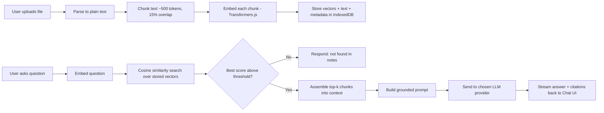
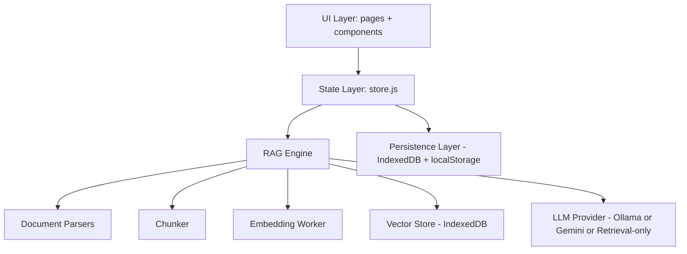

# PROJECT_PLAN.md

## NotesMind — A Private, Local-First RAG Chatbot for Your Notes

**Document type:** Master engineering specification (single source of truth)
**Intended reader:** An autonomous AI coding agent (e.g. Antigravity) that will build this application without further clarification
**Status:** Planning complete — ready for implementation
**Total cost to build and run:** ₹0 (zero recurring cost, no credit card required)

---

## 0. How to Use This Document

This file is the **only** specification the coding agent needs. It is written so that every ambiguous decision has already been made. Where multiple implementation options exist, one is chosen as the default and alternatives are listed as optional upgrades. The agent should:

1. Read this document fully once, top to bottom.
2. Build in the exact phase order defined in **Section 12 (Development Roadmap)**.
3. Use the exact folder structure in **Section 11**.
4. Not introduce any framework, transpiler, or build tool beyond what is explicitly allowed in **Section 2**.
5. Treat every "Purpose / User Flow / Technical Implementation / UI Behaviour" block as a contract for that feature — implement all four aspects, not just the code.

If something in a later section appears to conflict with an earlier section, the more specific (later, feature-level) section wins.

---

## 1. Project Overview

**NotesMind** is a browser-based Retrieval-Augmented Generation (RAG) chatbot that answers questions **exclusively** from documents the user has personally uploaded. It never uses the underlying language model's own world knowledge and never calls out to the open internet for facts. If the answer cannot be found in the retrieved chunks of the user's notes, the assistant must explicitly say so rather than guess.

Conceptually, the product sits at the intersection of:

- **ChatGPT** — for the conversational chat UI and interaction model
- **Notion AI** — for the calm, minimal, document-centric aesthetic
- **Perplexity** — for inline source citations and a "retrieved context" panel
- **Linear** — for spacing, typography discipline, and motion polish

The defining constraint that shapes every architectural decision in this document is that **the entire application must run as static HTML, CSS, and vanilla JavaScript** — there is no server the user must pay for or maintain, and every AI capability (embeddings and/or generation) must be satisfiable using entirely free resources, ideally running locally in the browser or on the user's own machine.

### 1.1 Why this project is a strong portfolio piece

A RAG chatbot is one of the most in-demand AI engineering patterns in 2025–2026, but almost every public tutorial reaches for a Python backend, a hosted vector database, and a paid LLM API. Building the same pattern with nothing but HTML/CSS/JS, an in-browser vector index, and a free-tier or local model demonstrates:

- Deep understanding of the RAG pipeline itself (chunking, embeddings, similarity search, context-window construction, grounding) rather than dependency on a framework that hides it.
- Strong vanilla JavaScript architecture skills (module design, state management, async orchestration) without React/Vue as a crutch.
- Product thinking: designing empty states, loading states, error states, and citations the way a real SaaS company would.
- Resourcefulness: delivering a genuinely useful, non-toy product at zero cost.

---

## 2. Tech Stack (Mandatory & Exhaustive)

### 2.1 Allowed

| Layer | Technology | Notes |
|---|---|---|
| Markup | HTML5 | Semantic elements throughout (`<main>`, `<nav>`, `<section>`, `<dialog>`, etc.) |
| Styling | CSS3 | Custom properties (CSS variables) for design tokens, Grid + Flexbox for layout, no preprocessor |
| Logic | Vanilla JavaScript (ES6+) | Native ES Modules (`type="module"`), no bundler required to run the app |
| In-browser ML | [Transformers.js](https://huggingface.co/docs/transformers.js) (via CDN, ESM import) | Runs a free, open embedding model entirely client-side using WebAssembly/WebGPU |
| In-browser vector storage | Hand-rolled JS vector index (Section 6.5) persisted via **IndexedDB** | No external vector DB service |
| Local generation (optional, recommended) | [Ollama](https://ollama.ai) running on the user's machine, called via `fetch()` to `http://localhost:11434` | Completely free, fully offline, no API key |
| Hosted generation (optional fallback) | Google **Gemini API free tier** (`gemini-1.5-flash` / current free-tier model) called directly from the browser with a user-supplied free API key | Free tier, no credit card required at signup; entirely optional |
| File parsing | `pdf.js` (Mozilla, CDN) for PDF; a small vanilla JS DOCX-XML unzip/parse routine (using the browser's native `DecompressionStream` + `DOMParser`, no Node dependency) for `.docx`; native `FileReader` for `.txt`/`.md` | All parsing happens client-side |
| Markdown rendering in chat | `marked.js` (CDN, no dependencies) | Small, free, permissively licensed |
| Code syntax highlighting | `highlight.js` (CDN) | Free, no account needed |
| Icons | [Lucide Icons](https://lucide.dev) static SVGs, inlined | No icon font, no external requests at runtime |
| Fonts | Self-hosted variable font ("Inter" or system font stack fallback) | Avoid a hard dependency on Google Fonts CDN so the app can run fully offline |

### 2.2 Explicitly disallowed

React, Next.js, Vue, Angular, Svelte, TypeScript, Tailwind CSS, Bootstrap, jQuery, any Node.js **backend** (Express, Fastify, etc.), Python backend, any paid API, any service requiring a credit card, any service with a mandatory recurring fee.

> **Clarification on "no Node.js backend":** Node/npm may still be used *locally during development* purely as an optional static file server (e.g. `npx serve`) or for running a linter, because nothing here is deployed or paid for. The **shipped application** must be pure static files (HTML/CSS/JS + assets) deployable to any free static host (GitHub Pages, Netlify free tier, Vercel free tier, or literally opened as `file://`).

### 2.3 CDN dependency table (all free, no signup)

| Library | Purpose | Load method |
|---|---|---|
| `@xenova/transformers` (Transformers.js) | Client-side embeddings (`all-MiniLM-L6-v2` quantized) | `import` from `https://cdn.jsdelivr.net/npm/@xenova/transformers` (ESM) |
| `pdf.js` | PDF text extraction | `https://cdn.jsdelivr.net/npm/pdfjs-dist` |
| `marked` | Markdown → HTML for chat bubbles | `https://cdn.jsdelivr.net/npm/marked` |
| `highlight.js` | Code block syntax highlighting | `https://cdn.jsdelivr.net/npm/highlight.js` |

All four are pinned to a specific version in `index.html`/import maps so the build is reproducible, and all are cached by the Service Worker (Section 9.4) so the app keeps working offline after first load.

---

## 3. Cost Model — Guaranteed ₹0

| Concern | Free solution used | Why it's genuinely free |
|---|---|---|
| Hosting | GitHub Pages / Netlify free tier / local `file://` | Static files only, no server compute billed |
| Embeddings | Transformers.js running `all-MiniLM-L6-v2` in-browser | Model weights downloaded once from Hugging Face's free CDN, inference runs on the user's own CPU/GPU |
| Vector storage | IndexedDB (built into every browser) | No external database, no storage fees |
| Answer generation (primary) | Ollama running locally (e.g. `llama3.2:3b`, `phi3`, `qwen2.5:3b`) | User installs Ollama once; all inference is local, no API key, no rate limit, no bill |
| Answer generation (optional fallback) | Gemini API free tier | Google's free tier requires only a Google account, explicitly no credit card, and has a documented free daily quota |
| Document parsing | pdf.js, native DOMParser | Open-source, MIT/Apache licensed |
| Fonts/Icons | Self-hosted / inlined SVG | No runtime licensing fee |

**No feature in this document may be implemented in a way that requires payment.** Anywhere Gemini is used, it must be clearly labeled "optional" and the app must be fully functional with Ollama alone, or even in a degraded "retrieval-only" mode (Section 6.7) if neither is configured.

---

## 4. AI Strategy

### 4.1 Two independent AI concerns

RAG has two separate AI jobs that must not be confused:

1. **Embedding** — turning text into vectors for similarity search. This *always* happens locally via Transformers.js. It is small, fast, and never needs an internet call after the model is cached.
2. **Generation** — turning retrieved context + question into a natural-language answer. This is pluggable (Section 4.2) so the user can choose their free option.

### 4.2 Pluggable generation providers

The Settings page (Section 8.6) lets the user pick a **Model Provider**:

| Provider | Setup required | Recommended for |
|---|---|---|
| **Ollama (local)** — default recommendation | Install Ollama desktop app, `ollama pull llama3.2:3b` | Users who want full privacy and zero setup after install |
| **Gemini API (free tier)** | Paste a free Gemini API key obtained from Google AI Studio | Users without a capable local machine |
| **Retrieval-only mode** | None | Users who just want to see matched excerpts without any generation step; the app shows the raw retrieved chunks as the "answer" |

The provider is implemented behind a single JS interface, `LLMProvider`, with one method: `generate({ question, context }) -> Promise<string>`. Swapping providers means swapping the object that satisfies this interface — no other code changes. This is documented fully in Section 6.6.

### 4.3 Strict grounding rule

Every prompt sent to the generation provider follows this fixed template (Section 6.6.2) instructing the model to answer **only** from the provided context and to say the fixed fallback sentence if the answer isn't present. This is a prompt-level guarantee, reinforced at the UI level by a **Confidence Score** (Section 7.6) computed from retrieval similarity — if the best-matching chunk's cosine similarity is below a threshold (default `0.35`), the app skips calling the LLM entirely and immediately shows the "couldn't find this" message, which also saves the user a wasted local-inference call.

---

## 5. RAG Behaviour (End-to-End Pipeline)



### 5.1 Document upload
The user drags a file (or clicks to browse) onto the Upload screen. Accepted types are validated client-side by MIME type and extension before any processing begins (Section 10.3, Safe File Handling).

### 5.2 Document parsing
Each file type has a dedicated parser module (Section 11's `src/lib/parsers/`) that converts the file into normalized plain text plus metadata (`{ text, pageCount?, title, sourceFileName }`).

### 5.3 Chunking
Plain text is split into overlapping chunks to preserve context across chunk boundaries. Default parameters (tunable in Settings → Advanced):

- **Chunk size:** ~500 tokens (approximated as ~2,000 characters for the tokenizer-free estimate, refined using the actual Transformers.js tokenizer during embedding)
- **Overlap:** 15% (≈75 tokens) so a sentence split across a chunk boundary still appears whole in at least one chunk
- **Splitting strategy:** paragraph-aware — the chunker first splits on double newlines, then greedily packs paragraphs into chunks up to the size limit, only hard-splitting a single oversized paragraph as a last resort, so chunks don't cut mid-sentence when avoidable.

### 5.4 Embedding generation
Each chunk's text is passed through the `all-MiniLM-L6-v2` sentence-embedding model (384-dimensional vectors) via Transformers.js, run in a **Web Worker** (Section 6.4) so the UI thread never blocks. Embeddings are generated in batches with a visible progress bar (Section 7 — Loading States).

### 5.5 Vector storage
Each chunk is stored as a record: `{ id, knowledgeBaseId, documentId, chunkIndex, text, vector: Float32Array(384), tokenCount, createdAt }` inside an IndexedDB object store (Section 6.5). Vectors persist across browser sessions — there is no server round-trip.

### 5.6 Semantic retrieval
On each user question, the question is embedded the same way, then compared against every stored vector in the active Knowledge Base using cosine similarity. The top-k (default k=5) highest-scoring chunks are selected as candidate context, subject to a maximum total context character budget (Section 6.6.1) to keep local-model prompts fast.

### 5.7 Context injection
Selected chunks are formatted into a structured context block, each one tagged with a source label (`[Source: filename.pdf, chunk 3]`) so the model — and the UI's citation renderer — can trace every sentence in the answer back to its origin document.

### 5.8 Answer generation
The context block and question are inserted into the grounded prompt template (Section 6.6.2) and sent to the active `LLMProvider`. The response streams into the chat bubble token-by-token where the provider supports streaming (Ollama and Gemini both support streaming; retrieval-only mode "types out" the top chunk instantly).

### 5.9 Anti-hallucination guarantees (defense in depth)

1. **Prompt-level instruction** — explicit system instruction to only use provided context.
2. **Similarity threshold gate** — no LLM call at all if nothing relevant was retrieved.
3. **Visible citations** — every answer shows which chunks it drew from, so the user can verify.
4. **Confidence score** — a visible numeric/labelled signal of retrieval quality, so low-confidence answers are visually flagged even if the model still attempted an answer.
5. **Retrieved Context Viewer** — one click reveals the raw chunks the model saw, so the user is never blindly trusting the output.

---

## 6. Architecture

### 6.1 High-level module map



### 6.2 Layering rules

- **UI components never talk to IndexedDB or Transformers.js directly.** They dispatch actions to the State Layer and subscribe to state changes.
- **The State Layer never touches the DOM.** It's a plain JS module holding the application state object plus a pub/sub mechanism.
- **The RAG Engine is UI-agnostic.** It could theoretically run in a CLI. It exposes a small async API: `ingestDocument(file, kbId)`, `deleteDocument(docId)`, `query(question, kbId)`.

### 6.3 State management (no framework)

A single `store.js` module implements a minimal, framework-free observable store:

```javascript
// src/state/store.js
const state = {
  knowledgeBases: [],       // [{ id, name, documentCount, createdAt }]
  activeKbId: null,
  documents: [],             // metadata only; vectors live in IndexedDB
  chats: [],                  // [{ id, kbId, title, messages: [...] }]
  activeChatId: null,
  theme: 'dark',              // 'dark' | 'light'
  settings: { provider: 'ollama', ollamaModel: 'llama3.2:3b', geminiKey: '', topK: 5, threshold: 0.35 },
  ui: { isEmbedding: false, embeddingProgress: 0, isGenerating: false }
};

const listeners = new Set();

export function getState() { return state; }

export function setState(patch) {
  Object.assign(state, patch);
  listeners.forEach((fn) => fn(state));
}

export function subscribe(fn) {
  listeners.add(fn);
  return () => listeners.delete(fn);
}
```

Every UI component subscribes only to the slice of state it cares about and re-renders its own DOM subtree — a lightweight manual analogue of what React would do, but with zero framework overhead. This keeps the "Vanilla JS Architecture" requirement genuinely clean rather than reinventing React badly.

### 6.4 Web Worker usage

Embedding generation (and optionally local Ollama streaming parsing) is offloaded to a dedicated Worker (`src/workers/embedding.worker.js`) so:

- Uploading a 50-page PDF does not freeze scrolling, typing, or animations.
- Multiple documents can be queued and processed sequentially with a visible per-document progress bar.

Communication uses `postMessage` with a typed message contract: `{ type: 'EMBED_BATCH', payload: { chunks } }` → `{ type: 'EMBED_PROGRESS', payload: { done, total } }` → `{ type: 'EMBED_RESULT', payload: { vectors } }`.

### 6.5 Vector store design (`src/lib/vectorStore.js`)

IndexedDB database `notesmind-db` with object stores:

| Store | Key | Indexes | Purpose |
|---|---|---|---|
| `knowledgeBases` | `id` | `name` | KB metadata |
| `documents` | `id` | `kbId` | Uploaded file metadata (name, type, size, uploadedAt, chunkCount, status) |
| `chunks` | `id` | `kbId`, `documentId` | Chunk text + `Float32Array` vector + position |
| `chats` | `id` | `kbId` | Conversation metadata |
| `messages` | `id` | `chatId` | Individual chat messages + citations + confidence |
| `settings` | `key` | — | Single-row app settings (also mirrored to `localStorage` for instant read on boot) |

Similarity search is implemented as an in-memory scan (loading a KB's chunk vectors into a typed array cache on first query, then computing cosine similarity in a tight loop) — this is fast enough for tens of thousands of chunks in-browser and avoids the complexity of an ANN index; a note in Section 13 (Performance) documents the upgrade path (HNSW via a WASM library) if a user's knowledge base grows very large.

### 6.6 LLM Provider interface

#### 6.6.1 Context budget
Total injected context is capped (default 6,000 characters, configurable) to keep local model latency reasonable. Chunks are added in descending similarity order until the budget is reached.

#### 6.6.2 Grounded prompt template

```
SYSTEM:
You are a strict retrieval-based assistant. You must answer the user's question
using ONLY the information inside the <context> block below. Do not use any
outside knowledge. Do not guess or infer beyond what is written. If the answer
is not contained in the context, reply exactly with:
"I couldn't find this information in the uploaded notes."
Always mention which source(s) you used by their bracketed label, e.g. [Source: filename.pdf, chunk 3].

<context>
{{retrieved_chunks_with_labels}}
</context>

USER QUESTION:
{{user_question}}
```

#### 6.6.3 Provider implementations

```javascript
// src/lib/llm/OllamaProvider.js
export class OllamaProvider {
  constructor(model = 'llama3.2:3b') { this.model = model; }
  async generate({ prompt, onToken }) {
    const res = await fetch('http://localhost:11434/api/generate', {
      method: 'POST',
      body: JSON.stringify({ model: this.model, prompt, stream: true })
    });
    // read the streamed NDJSON response, calling onToken(chunk) per token
  }
}

// src/lib/llm/GeminiProvider.js
export class GeminiProvider {
  constructor(apiKey) { this.apiKey = apiKey; }
  async generate({ prompt, onToken }) {
    // fetch to Gemini's free-tier generateContent endpoint with streaming enabled
  }
}

// src/lib/llm/RetrievalOnlyProvider.js
export class RetrievalOnlyProvider {
  async generate({ context, onToken }) {
    // "types out" the top chunk verbatim as a transparent fallback, no network call
  }
}
```

All three implement the same `generate({ prompt, context, onToken }) -> Promise<string>` shape so `chatController.js` never needs to know which one is active.

### 6.7 Degraded / offline modes

| Condition | Behaviour |
|---|---|
| No documents uploaded yet | Chat input disabled with helper text "Upload notes to start chatting" |
| Ollama not running / unreachable | Toast + Settings badge turns red; app suggests switching provider |
| No Gemini key set but Gemini selected | Inline warning in Settings, provider auto-falls-back to Retrieval-only |
| Offline (no internet) after first load | Everything except the optional Gemini provider continues working, because Transformers.js model weights and all CDN libs are cached by the Service Worker |

---

## 7. UI/UX Specification

### 7.1 Design philosophy
Calm, confident, content-first. Generous whitespace, one accent color used sparingly, subtle motion that communicates state changes rather than decorating them. No gradients-for-the-sake-of-gradients, no unnecessary shadows. The product should feel like it belongs next to Notion, Linear, and Perplexity, not like a hackathon demo.

### 7.2 Landing Page (`index.html`)
- **Purpose:** Explain the product in 5 seconds and get the user into the Upload/Dashboard flow.
- **User Flow:** Visitor lands → reads hero headline + one-line subtext → sees 3 feature highlight cards (Private by design / Real citations / 100% free) → clicks primary CTA "Get Started" → routed to Dashboard (which shows the empty state / Upload screen if no KB exists yet).
- **Technical Implementation:** Static section in `index.html` (or `pages/landing.html` if using multi-page routing — see Section 6.8 note below); a subtle scroll-reveal animation using `IntersectionObserver`, no JS framework needed.
- **UI Behaviour:** Sticky top nav with logo, "Docs"/"About" links, theme toggle, and CTA button. Hero has a soft animated gradient mesh **background only** (not text), kept at low opacity so it never fights with content.

### 7.3 Upload Screen
- **Purpose:** Get the user's documents into a Knowledge Base as frictionlessly as possible.
- **User Flow:** User selects or creates a Knowledge Base → drags files onto the dropzone (or clicks "Browse") → sees each file appear in a queue list with a live progress bar (Parsing → Chunking → Embedding → Done) → once complete, a success toast appears and the user is offered "Start chatting" or "Upload more."
- **Technical Implementation:** `dragenter`/`dragover`/`drop` handlers with visual affordance (dropzone border changes to accent color on drag-over); each file processed through the pipeline in Section 5 with progress events surfaced from the Embedding Worker.
- **UI Behaviour:**
  - *Empty state:* large dashed dropzone, icon, "Drag & drop your notes here or click to browse," accepted format badges (PDF · DOCX · TXT · MD).
  - *Loading state:* per-file row with filename, size, animated progress bar, and current pipeline stage label.
  - *Error state:* row turns to a soft red-tinted background with an inline error message ("Couldn't read this PDF — it may be scanned/image-only") and a Retry button.
  - *Success state:* green check icon, chunk count summary ("42 chunks created"), fade-in.

### 7.4 Dashboard
- **Purpose:** Home base showing all Knowledge Bases, recent chats, and quick actions.
- **User Flow:** User sees a grid of Knowledge Base cards (name, doc count, last updated) → clicks a card to open its Chat page, or clicks "+ New Knowledge Base."
- **Technical Implementation:** Cards rendered from `state.knowledgeBases`; clicking a card sets `activeKbId` and navigates to Chat.
- **UI Behaviour:** Empty state ("You haven't created a Knowledge Base yet" + illustration + CTA) vs. populated grid with hover-lift micro-interaction on cards (`transform: translateY(-2px)` + shadow increase, 150ms ease).

### 7.5 Chat Page — the core experience
- **Purpose:** Where the user actually converses with their notes.
- **User Flow:** User types a question in the composer → presses Enter (Shift+Enter for newline) → sees their message appear instantly → sees a "Thinking…" indicator with a retrieval sub-step ("Searching 3 documents…") → assistant message streams in token by token → citations chips appear beneath the message → user can click a citation to open the Retrieved Context Viewer.
- **Technical Implementation:** Two-column layout: left sidebar (chat history for the active KB, collapsible on mobile), main column (message list + composer). Message list uses a virtualized-lite approach (only render last ~50 messages fully; older ones lazy-mount on scroll-up) to keep performance smooth on long conversations.
- **UI Behaviour:**
  - *Empty state:* centered prompt suggestions ("Summarize my notes on…", "What does the document say about…") as clickable chips.
  - *Loading state:* three-dot typing indicator, then token-by-token streaming text.
  - *Error state:* if the provider fails (e.g., Ollama not running), the assistant bubble shows an inline error card with a "Fix in Settings" button instead of a fake answer.
  - *Success/citation state:* below each assistant message, small pill-shaped source chips (`📄 filename.pdf · chunk 3`); clicking one opens a slide-over panel (Section 7.5.1).
  - *Confidence badge:* a small colored dot + label (High / Medium / Low confidence) next to the timestamp, derived from the top similarity score.

#### 7.5.1 Retrieved Context Viewer
A right-side slide-over panel listing the exact chunks used to answer the last question, each with its similarity score, source document, and a "Jump to document" link (opens the Knowledge Base Manager's document preview). This is the trust-building centerpiece of the whole product.

### 7.6 Confidence Score
- **Purpose:** Make retrieval quality visible instead of implicit.
- **Technical Implementation:** `confidence = topChunkSimilarity` mapped to labels: `≥0.65` → High (green), `0.35–0.65` → Medium (amber), `<0.35` → Low / not answered (red, triggers the fallback message instead of a generation call).
- **UI Behaviour:** Small dot + label, tooltip on hover explaining "based on how closely your notes matched this question."

### 7.7 Knowledge Base Manager
- **Purpose:** Full CRUD control over documents and knowledge bases.
- **User Flow:** User sees a table of documents (name, type, size, chunk count, uploaded date) with search/filter → can delete a document, rebuild its embeddings (e.g., after changing chunk size in Settings), or clear the entire KB.
- **Technical Implementation:** Table rendered from IndexedDB `documents` store; delete/rebuild actions dispatch to `ragEngine.js` which removes/regenerates the corresponding `chunks` rows.
- **UI Behaviour:** Destructive actions (delete document, clear KB) require a confirmation `<dialog>` modal with the item name typed or a clear "This cannot be undone" warning; success shows a toast; a search box does live client-side filtering of the table.

### 7.8 Settings Page
- **Purpose:** Configure provider, theme, and advanced RAG parameters.
- **Sections:** Model Provider (Ollama/Gemini/Retrieval-only + connection test button), Appearance (Dark/Light/System), Advanced RAG (chunk size, overlap, top-k, similarity threshold — with sensible min/max sliders and a "Reset to defaults" link), Data & Privacy (Export all data as JSON, Clear all local data with confirmation), Keyboard Shortcuts reference.
- **UI Behaviour:** Changes save immediately (no separate Save button) with a small inline "Saved" flash next to the changed control; a "Test connection" button for Ollama pings `http://localhost:11434` and shows a green/red status pill.

### 7.9 About Page
- **Purpose:** Explain the project, tech stack, and privacy model for portfolio visitors/recruiters.
- **Content:** Short product description, architecture diagram (reuse Section 6.1's Mermaid diagram rendered at build time or as a static SVG), tech stack badges, link to source repository, and a clear statement: "Your documents never leave your device unless you explicitly choose the Gemini provider."

### 7.10 Navigation behaviour
- Persistent left icon-rail (Dashboard, Chat, Knowledge Base, Settings, About) on desktop ≥1024px; collapses into a bottom tab bar on mobile (<768px).
- Active route indicated by accent-colored left border (desktop) or filled icon (mobile).
- Route changes use the History API (`pushState`) with a tiny hash-free client router (`src/router.js`, ~40 lines) — no framework required since there are only 6 top-level views.

### 7.11 Notifications
A single global toast system (`src/components/Toast.js`) queues success/error/info toasts in the bottom-right (desktop) / bottom-center (mobile), auto-dismissing after 4s with a manual close (×) and a pause-on-hover timer.

### 7.12 Animation & motion principles
- Durations: micro-interactions 100–150ms, panel transitions 200–250ms, page transitions 300ms — all `ease-out` for entrances, `ease-in` for exits.
- Respect `prefers-reduced-motion`: all non-essential animation is disabled/shortened when the user has this OS setting enabled.
- Streaming text uses a simple incremental `textContent` append rather than heavy per-character DOM churn, batched via `requestAnimationFrame` for smoothness.

### 7.13 Accessibility
- All interactive elements reachable via keyboard (Tab order verified per page); visible focus rings (`:focus-visible`) styled with the accent color, never removed.
- Color contrast meets WCAG AA (4.5:1 body text) in both themes — verify accent color against both backgrounds.
- Live regions (`aria-live="polite"`) on the chat message list so streaming answers are announced to screen readers without spamming them per character.
- Dialogs use the native `<dialog>` element for built-in focus trapping and Escape-to-close.

---

## 8. Features — Detailed Specifications

Each feature below follows **Purpose → User Flow → Technical Implementation → UI Behaviour**.

### 8.1 Drag & Drop Upload
- **Purpose:** Remove friction from getting notes into the app.
- **User Flow:** Drag file(s) anywhere onto the Upload dropzone; multiple files can be dropped at once and are queued sequentially.
- **Technical Implementation:** Native Drag and Drop API (`dragover`, `drop`, `e.dataTransfer.files`); each file validated (type/size) before entering the processing queue in `src/lib/uploadQueue.js`.
- **UI Behaviour:** Dropzone highlights on drag-over; invalid files show an immediate inline rejection ("Unsupported file type") without blocking valid files in the same batch.

### 8.2 Multiple Knowledge Bases
- **Purpose:** Let users separate contexts (e.g., "University Notes" vs "Work Docs") so retrieval never mixes unrelated material.
- **User Flow:** Create a new KB from the Dashboard with a name; switch active KB via a dropdown in the top nav; each KB has fully isolated documents, chunks, and chat history.
- **Technical Implementation:** All IndexedDB queries scoped by `kbId`; `activeKbId` in global state gates retrieval and the document list.
- **UI Behaviour:** KB switcher dropdown shows document count per KB; switching KB clears the visible chat pane and loads that KB's chat history.

### 8.3 Chat History
- **Purpose:** Let users resume prior conversations.
- **User Flow:** Sidebar lists past chats for the active KB, newest first, auto-titled from the first user message; clicking one loads its full transcript.
- **Technical Implementation:** `chats`/`messages` IndexedDB stores; auto-title generated client-side by truncating the first message (no extra LLM call needed to keep it free/fast).
- **UI Behaviour:** Active chat highlighted in sidebar; hover reveals rename/delete icon buttons; empty state prompts "Start a new chat."

### 8.4 Search History
- **Purpose:** Quickly find a past question without scrolling.
- **User Flow:** User opens a search box (⌘/Ctrl+K) that filters across all chat titles and message content for the active KB.
- **Technical Implementation:** Simple client-side substring/fuzzy match over cached message text (no server search needed at this scale).
- **UI Behaviour:** Command-palette style modal (`<dialog>`) with keyboard navigation (arrow keys + Enter to jump to result).

### 8.5 Source Citations
- **Purpose:** Ground every answer in a verifiable source.
- **User Flow:** Described in 7.5 — citation chips beneath each assistant message.
- **Technical Implementation:** The LLM response is parsed for `[Source: ...]` tags matched back against the retrieved chunk list (fallback: if the model omits tags, the UI still shows the raw top-k chunks used, since retrieval — not generation — determines citations).
- **UI Behaviour:** Pill chips, click → Retrieved Context Viewer scrolled to that chunk.

### 8.6 Confidence Score
Covered in 7.6.

### 8.7 Retrieved Context Viewer
Covered in 7.5.1.

### 8.8 Markdown Rendering
- **Purpose:** Let answers use lists, headings, bold text, and tables cleanly.
- **User Flow:** Assistant responses are automatically formatted; no user action needed.
- **Technical Implementation:** `marked.parse()` on the completed (or incrementally streamed) response text, sanitized before insertion (basic allow-list sanitizer to prevent script injection from model output, since the output is rendered as HTML).
- **UI Behaviour:** Standard chat-bubble typography — tables scroll horizontally on mobile instead of overflowing.

### 8.9 Code Highlighting
- **Purpose:** Readable code blocks when notes contain technical content.
- **Technical Implementation:** `highlight.js` auto-detects language on any ```` ``` ```` fenced block rendered by `marked`.
- **UI Behaviour:** Monospace font, subtle background tint, copy-to-clipboard icon button on hover.

### 8.10 Typing Animation
- **Purpose:** Communicate "the model is composing" state and make streaming feel alive.
- **Technical Implementation:** Three-dot bounce animation (pure CSS `@keyframes`) while waiting for the first token; once tokens start arriving, replaced by the incremental text append described in 7.12.
- **UI Behaviour:** Dots use the accent color at low opacity, staggered animation-delay per dot.

### 8.11 Dark Mode / Light Mode
- **Purpose:** Comfortable viewing in any environment; portfolio polish.
- **Technical Implementation:** CSS custom properties defined twice under `:root` and `[data-theme="light"]`; toggle sets `data-theme` on `<html>` and persists choice to `localStorage`; defaults to `prefers-color-scheme` on first visit.
- **UI Behaviour:** Toggle in top nav with a smooth icon morph (sun ↔ moon) and a brief cross-fade on the background/text colors (150ms) to avoid a jarring flash.

### 8.12 Mobile Responsive Design
- **Purpose:** Full usability on phones, since notes-review often happens on the go.
- **Technical Implementation:** Mobile-first CSS with breakpoints at 480px / 768px / 1024px / 1440px using CSS Grid `minmax()`/`clamp()` for fluid sizing rather than many fixed breakpoints.
- **UI Behaviour:** Sidebar becomes an overlay drawer; nav becomes a bottom tab bar; composer sticks to the bottom with safe-area padding for notched devices.

### 8.13 Export Chat
- **Purpose:** Let users keep a copy of a useful conversation.
- **User Flow:** "Export" button in chat header → choose Markdown or JSON → file downloads.
- **Technical Implementation:** Client-side blob generation (`new Blob([...], {type})` + `URL.createObjectURL` + a temporary `<a download>` click) — no server involved.
- **UI Behaviour:** Small dropdown menu on the export icon button; success toast on download start.

### 8.14 Clear Knowledge Base
- **Purpose:** Full reset of a KB's documents/chunks (keeping the KB itself, or deleting it entirely — both offered).
- **Technical Implementation:** Bulk delete across `documents`/`chunks`/optionally `chats` IndexedDB stores scoped to `kbId`.
- **UI Behaviour:** Destructive confirmation dialog (7.7) with explicit item counts ("This will delete 12 documents and 340 chunks").

### 8.15 Delete Documents
- **Purpose:** Remove a single outdated file without touching the rest of the KB.
- **Technical Implementation:** Delete the `documents` row and all `chunks` rows where `documentId` matches.
- **UI Behaviour:** Row-level delete icon in the Knowledge Base Manager table, confirmation dialog for single-item delete kept lightweight (no typed confirmation needed, just Undo-able toast for 5 seconds via a soft-delete flag).

### 8.16 Rebuild Embeddings
- **Purpose:** Regenerate vectors after the user changes chunk size/overlap in Settings, or if the embedding model is upgraded later.
- **User Flow:** "Rebuild Embeddings" button in Settings/Advanced or per-document in the Manager → progress bar → completion toast.
- **Technical Implementation:** Re-runs chunking + embedding (Section 5.3–5.5) on the stored raw text (raw parsed text is retained in the `documents` store precisely to make this cheap — no re-parsing of the original file needed).
- **UI Behaviour:** Same progress UI pattern as initial upload for consistency.

### 8.17 Search Documents
- **Purpose:** Find a specific document by name/type quickly in a large KB.
- **Technical Implementation:** Live-filtering `<input>` over the Knowledge Base Manager table, debounced 150ms.
- **UI Behaviour:** Instant highlight of matching substrings in the filtered results.

### 8.18 Keyboard Shortcuts
- **Purpose:** Power-user efficiency, expected in a modern SaaS tool.
- **Shortcut table:**

| Shortcut | Action |
|---|---|
| `⌘/Ctrl + K` | Open search / command palette |
| `⌘/Ctrl + N` | New chat |
| `⌘/Ctrl + U` | Open Upload screen |
| `⌘/Ctrl + \` | Toggle sidebar |
| `Enter` | Send message |
| `Shift + Enter` | Newline in composer |
| `Esc` | Close any open dialog/panel |

- **Technical Implementation:** Single global `keydown` listener in `src/lib/shortcuts.js` dispatching to the router/state layer, careful to ignore shortcuts while focus is inside a text field (except Enter/Shift+Enter which are field-specific).
- **UI Behaviour:** Shortcuts reference visible in Settings; small `⌘K` hint badge shown inside the search trigger button.

---

## 9. Performance

| Concern | Strategy |
|---|---|
| Lazy Loading | Route views are lazy-loaded via dynamic `import()` per page module; heavy libs (`pdf.js`, `@xenova/transformers`) are only imported when the Upload screen or embedding pipeline actually needs them |
| Efficient Embeddings | Quantized model (`all-MiniLM-L6-v2`, int8) via Transformers.js keeps model download small (~25MB, cached after first load) and inference fast on CPU; batched embedding calls instead of one-chunk-at-a-time |
| Fast Search | In-memory `Float32Array` similarity scan per query (Section 6.5); vectors kept in a typed-array cache per active KB rather than re-reading IndexedDB on every keystroke |
| Optimized Rendering | Manual DOM diff avoided in favor of targeted `textContent`/attribute updates per component (no full re-render of the chat list on each token); message list uses lazy-mount for older messages (Section 7.5) |
| Browser Storage | IndexedDB for bulk data (vectors, chunks, messages); `localStorage` only for small, frequently-read settings (theme, active KB id) to avoid async round-trips on boot |
| Memory Management | Embedding Worker is terminated and recreated between large batch jobs to release WASM memory; typed-array vector caches are evicted for inactive Knowledge Bases beyond a configurable memory budget |
| Caching | Service Worker (Section 9.4-equivalent, see 6.7) precaches the app shell + CDN libs + model weights for instant repeat loads and offline capability |

---

## 10. Security & Privacy

### 10.1 Local-first storage strategy
All user data — documents, chunks, vectors, chat history — lives exclusively in the browser's IndexedDB on the user's own device. Nothing is uploaded to any server owned by this application, because this application has no backend server at all.

### 10.2 Privacy guarantees
- The only network calls this app ever makes with user content are: (a) to `localhost:11434` (the user's own machine, if Ollama is chosen) and (b) optionally to Google's Gemini endpoint, only if the user explicitly pastes their own API key and selects that provider.
- No analytics, no telemetry, no third-party tracking scripts.
- The About page and Settings page both state this plainly so it's never a hidden assumption.

### 10.3 Safe file handling
- Uploaded files are validated by extension **and** a light content sniff (checking magic bytes/MIME) before parsing, rejecting anything that doesn't match an accepted type.
- PDF/DOCX parsing runs entirely client-side via `pdf.js`/the vanilla DOCX parser — files are never sent anywhere to be converted.
- A maximum file size (default 25MB, configurable) prevents accidental browser memory exhaustion.
- Rendered model output (Markdown → HTML, Section 8.8) is passed through a minimal HTML sanitizer allow-listing only safe tags (`p, strong, em, ul, ol, li, code, pre, table, thead, tbody, tr, td, th, a[href], h1-h4, blockquote`) before insertion, mitigating any injection risk from adversarial document content that might end up echoed in a response.

### 10.4 Offline usage
Because embeddings run locally and Ollama runs locally, the entire core loop — upload, chunk, embed, retrieve, and (with Ollama) generate — works with **zero internet connection** once the app shell and model weights are cached by the Service Worker on first load.

---

## 11. Folder Structure

```
notesmind/
├── index.html                     # App shell: single entry point, mounts the router
├── manifest.webmanifest           # PWA manifest (installable, offline-capable)
├── service-worker.js              # Precache + runtime cache strategy (Section 6.7)
├── README.md                      # Setup instructions, screenshots, architecture summary
│
├── assets/
│   ├── icons/                     # Inlined/optimized Lucide SVGs used across the app
│   ├── fonts/                     # Self-hosted variable font files
│   └── images/                    # Landing page illustrations, empty-state graphics
│
├── styles/
│   ├── tokens.css                 # CSS custom properties: color, spacing, radius, shadow, motion tokens (both themes)
│   ├── base.css                   # Resets, typography defaults, global element styles
│   ├── layout.css                 # Grid/flex layout primitives shared across pages (nav rail, columns)
│   ├── components/                # One file per reusable component (button.css, card.css, chat-bubble.css, dialog.css, toast.css, dropzone.css, badge.css, table.css)
│   └── pages/                     # Page-specific styles (landing.css, dashboard.css, chat.css, kb-manager.css, settings.css, about.css)
│
├── src/
│   ├── main.js                    # App bootstrap: init state, router, theme, service worker registration
│   ├── router.js                  # Minimal History-API router mapping paths to page modules
│   │
│   ├── pages/                     # One controller module per top-level view; each exports render(container)
│   │   ├── landing.js
│   │   ├── dashboard.js
│   │   ├── upload.js
│   │   ├── chat.js
│   │   ├── kbManager.js
│   │   ├── settings.js
│   │   └── about.js
│   │
│   ├── components/                # Reusable, framework-free UI components (each: create(props) -> HTMLElement)
│   │   ├── NavRail.js
│   │   ├── Toast.js
│   │   ├── ConfirmDialog.js
│   │   ├── CommandPalette.js
│   │   ├── ChatBubble.js
│   │   ├── CitationChip.js
│   │   ├── ContextViewerPanel.js
│   │   ├── ConfidenceBadge.js
│   │   ├── Dropzone.js
│   │   ├── ProgressBar.js
│   │   ├── KbCard.js
│   │   └── DocumentTable.js
│   │
│   ├── state/
│   │   └── store.js                # Section 6.3 observable store
│   │
│   ├── rag/
│   │   ├── ragEngine.js            # Public API: ingestDocument, deleteDocument, rebuildEmbeddings, query
│   │   ├── chunker.js              # Paragraph-aware chunking (Section 5.3)
│   │   ├── similarity.js           # Cosine similarity + top-k selection
│   │   └── promptBuilder.js        # Builds the grounded prompt template (Section 6.6.2)
│   │
│   ├── lib/
│   │   ├── parsers/
│   │   │   ├── pdfParser.js
│   │   │   ├── docxParser.js
│   │   │   ├── txtParser.js
│   │   │   └── markdownParser.js
│   │   ├── llm/
│   │   │   ├── OllamaProvider.js
│   │   │   ├── GeminiProvider.js
│   │   │   └── RetrievalOnlyProvider.js
│   │   ├── vectorStore.js          # IndexedDB wrapper (Section 6.5)
│   │   ├── uploadQueue.js          # Section 8.1
│   │   ├── shortcuts.js            # Section 8.18
│   │   ├── sanitizer.js            # Section 10.3 HTML allow-list sanitizer
│   │   └── exportChat.js           # Section 8.13
│   │
│   └── workers/
│       └── embedding.worker.js     # Runs Transformers.js off the main thread (Section 6.4)
│
└── tests/
    ├── chunker.test.js
    ├── similarity.test.js
    ├── vectorStore.test.js
    └── parsers.test.js
```

Every folder maps 1:1 to a layer described in Section 6, so the coding agent should never need to guess where a new file belongs.

---

## 12. Development Roadmap

Each phase is independently testable and shippable — the app should be a usable (if incomplete) product at the end of every phase, not a pile of half-built pieces.

### Phase 0 — Project Scaffolding
- **Objectives:** Stand up the static app shell, design tokens, and routing so every later phase has a home to build into.
- **Deliverables:** Empty pages for all 7 routes reachable via the nav rail; theme toggle working; app installable as a PWA shell.
- **Files to build:** `index.html`, `styles/tokens.css`, `styles/base.css`, `styles/layout.css`, `src/main.js`, `src/router.js`, `src/state/store.js`, `src/components/NavRail.js`, `manifest.webmanifest`, `service-worker.js` (basic app-shell caching only).
- **Dependencies:** None.
- **Testing checklist:**
  - [ ] All 7 nav links route without a full page reload
  - [ ] Theme toggle persists across reload
  - [ ] Lighthouse PWA installability check passes
  - [ ] App loads with no console errors on Chrome, Firefox, Safari

### Phase 1 — Document Ingestion Pipeline
- **Objectives:** Get files parsed, chunked, embedded, and stored — the foundation everything else depends on.
- **Deliverables:** Working Upload screen with drag & drop, progress states, and successful storage of chunks+vectors in IndexedDB for PDF/DOCX/TXT/MD.
- **Files to build:** `src/pages/upload.js`, `src/components/Dropzone.js`, `src/components/ProgressBar.js`, `src/lib/parsers/*`, `src/rag/chunker.js`, `src/workers/embedding.worker.js`, `src/lib/vectorStore.js`, `src/lib/uploadQueue.js`.
- **Dependencies:** Phase 0. External libs: `pdf.js`, `@xenova/transformers`.
- **Testing checklist:**
  - [ ] Each of the 4 file types parses correctly on a real sample file
  - [ ] Oversized/invalid files are rejected with a clear inline error
  - [ ] Progress bar accurately reflects parse → chunk → embed stages
  - [ ] Chunks + vectors are verifiably persisted (inspect via DevTools → Application → IndexedDB)
  - [ ] Embedding runs in a Worker (main thread stays responsive — verified by scrolling/typing during a large upload)

### Phase 2 — Knowledge Base Management
- **Objectives:** Let users organize, inspect, and manage what they've uploaded.
- **Deliverables:** Dashboard with KB cards, KB creation/switching, Knowledge Base Manager table with search/delete/rebuild/clear.
- **Files to build:** `src/pages/dashboard.js`, `src/pages/kbManager.js`, `src/components/KbCard.js`, `src/components/DocumentTable.js`, `src/components/ConfirmDialog.js`, `src/components/Toast.js`.
- **Dependencies:** Phase 1 (needs real documents/chunks to manage).
- **Testing checklist:**
  - [ ] Creating a second KB fully isolates its documents from the first
  - [ ] Deleting a document removes its chunks (verify vector count drops)
  - [ ] Rebuild Embeddings changes vector count/content after a chunk-size setting change
  - [ ] Clear Knowledge Base requires confirmation and fully empties the relevant stores
  - [ ] Search/filter narrows the document table live with no perceptible lag

### Phase 3 — Retrieval & Generation Core
- **Objectives:** Implement the actual RAG query loop and the pluggable LLM providers.
- **Deliverables:** `ragEngine.query()` returns grounded, cited answers; provider switching works; retrieval-only mode works with zero setup.
- **Files to build:** `src/rag/similarity.js`, `src/rag/promptBuilder.js`, `src/rag/ragEngine.js` (query path), `src/lib/llm/OllamaProvider.js`, `src/lib/llm/GeminiProvider.js`, `src/lib/llm/RetrievalOnlyProvider.js`.
- **Dependencies:** Phase 1 (vector store must exist and be populated for meaningful testing).
- **Testing checklist:**
  - [ ] A question clearly answered in the notes returns a correct, cited answer
  - [ ] A question with no relevant content triggers the exact fallback sentence without calling the LLM
  - [ ] Switching provider in Settings changes which backend answers the next question
  - [ ] Ollama streaming and Gemini streaming both surface tokens incrementally to a test harness (even before Chat UI exists)
  - [ ] Confidence score threshold correctly gates the "not found" short-circuit

### Phase 4 — Chat Experience
- **Objectives:** Build the primary, portfolio-defining UI surface.
- **Deliverables:** Full Chat page — composer, streaming bubbles, citations, confidence badges, Retrieved Context Viewer, chat history sidebar, empty/loading/error states, Markdown + code rendering.
- **Files to build:** `src/pages/chat.js`, `src/components/ChatBubble.js`, `src/components/CitationChip.js`, `src/components/ContextViewerPanel.js`, `src/components/ConfidenceBadge.js`, `src/lib/sanitizer.js`, wiring for `marked`/`highlight.js`.
- **Dependencies:** Phase 3 (needs a working query pipeline to connect to).
- **Testing checklist:**
  - [ ] Sending a message shows the user bubble instantly, then a typing indicator, then a streamed response
  - [ ] Citation chips are clickable and open the correct chunk in the Context Viewer
  - [ ] Confidence badge color/label matches the actual similarity score returned
  - [ ] Chat history persists and reloads correctly after a full page refresh
  - [ ] Provider connection failure (e.g., Ollama stopped) shows the inline error card, not a broken UI
  - [ ] Markdown lists/tables/code blocks render correctly and are XSS-sanitized against a crafted adversarial input

### Phase 5 — Polish, Settings, Landing/About, and Extras
- **Objectives:** Round out the remaining pages and the "delight" features that make it feel like a finished product.
- **Deliverables:** Landing page, About page, full Settings page (provider config, advanced RAG params, data export/clear), Search History / Command Palette, Export Chat, Keyboard Shortcuts, final responsive/mobile pass, accessibility pass, Service Worker offline caching completed for all CDN libs + model weights.
- **Files to build:** `src/pages/landing.js`, `src/pages/settings.js`, `src/pages/about.js`, `src/components/CommandPalette.js`, `src/lib/shortcuts.js`, `src/lib/exportChat.js`, final `service-worker.js` runtime caching rules.
- **Dependencies:** Phases 0–4 complete.
- **Testing checklist:**
  - [ ] Full keyboard-only walkthrough of the entire app succeeds (no dead ends, all shortcuts work)
  - [ ] Lighthouse: Performance ≥90, Accessibility ≥95, Best Practices ≥95, PWA installable
  - [ ] App functions with airplane mode on (after first load) for the local-only path
  - [ ] Export Chat produces a valid, readable Markdown and JSON file
  - [ ] Mobile pass on a 375px viewport: no horizontal scroll, tap targets ≥44px, drawer nav works
  - [ ] `prefers-reduced-motion` and `prefers-color-scheme` are both respected on first load

### Phase 6 — QA, Documentation & Portfolio Packaging
- **Objectives:** Ship-ready polish and a README that sells the project to recruiters/visitors.
- **Deliverables:** Full README with setup instructions (including "how to install Ollama and pull a model"), architecture diagram, screenshots/GIF of the chat flow, deployment instructions for GitHub Pages/Netlify, a short demo script.
- **Files to build:** `README.md`, `tests/*` (unit tests for chunker, similarity, vectorStore, parsers).
- **Dependencies:** Phase 5.
- **Testing checklist:**
  - [ ] Fresh clone → static server → fully working app, no missing setup steps in the README
  - [ ] Unit tests pass for chunking edge cases (empty doc, single giant paragraph, doc shorter than one chunk)
  - [ ] Unit tests pass for similarity ranking correctness on a known small vector set
  - [ ] Deployed instance (GitHub Pages) verified working end-to-end, including the Gemini fallback path if a key is supplied

---

## 13. UI Design Guide

### 13.1 Color palette (design tokens in `styles/tokens.css`)

**Dark theme (default):**

| Token | Value | Usage |
|---|---|---|
| `--bg-base` | `#0B0D10` | App background |
| `--bg-surface` | `#14171B` | Cards, panels |
| `--bg-surface-raised` | `#1B1F24` | Modals, dropdowns |
| `--border-subtle` | `#262B31` | Dividers, card borders |
| `--text-primary` | `#F3F4F6` | Headlines, body text |
| `--text-secondary` | `#9CA3AF` | Captions, metadata |
| `--accent` | `#6366F1` (indigo) | Primary CTAs, active states, links |
| `--accent-hover` | `#7C7FF2` | Hover state of accent elements |
| `--success` | `#22C55E` | Success toasts, high confidence |
| `--warning` | `#F59E0B` | Medium confidence, non-blocking warnings |
| `--danger` | `#EF4444` | Destructive actions, errors, low confidence |

**Light theme:** background/surface/text values invert (`--bg-base: #FFFFFF`, `--bg-surface: #F7F8FA`, `--text-primary: #111827`, `--text-secondary: #6B7280`); `--accent`, `--success`, `--warning`, `--danger` stay the same hue family but are slightly deepened for AA contrast on white.

### 13.2 Typography
- **Typeface:** "Inter" (self-hosted variable font) with system fallback stack: `-apple-system, BlinkMacSystemFont, "Segoe UI", Roboto, sans-serif`.
- **Monospace (code):** `"JetBrains Mono", ui-monospace, SFMono-Regular, monospace`.
- **Scale** (via `clamp()` for fluid sizing): `--text-xs: 12px`, `--text-sm: 14px`, `--text-base: 16px`, `--text-lg: 18px`, `--text-xl: 22px`, `--text-2xl: 28px`, `--text-3xl: 36px`.
- **Weights:** 400 body, 500 UI labels/buttons, 600 subheadings, 700 headlines only.
- **Line height:** 1.5 for body text, 1.2 for headings.

### 13.3 Spacing system
4px base unit: `--space-1: 4px` through `--space-16: 64px` in a consistent scale (`1,2,3,4,6,8,12,16` multiples of the base). All padding/margin/gap values reference these tokens — no arbitrary pixel values in component CSS.

### 13.4 Grid system
12-column CSS Grid container (`max-width: 1280px`, centered, `--space-6` gutters) for wide layout pages (Landing, Dashboard); Chat/Settings/KB Manager use simpler two-region flex/grid layouts (nav rail + content, or content + side panel) rather than the 12-col grid, since they're app-shell pages, not marketing layouts.

### 13.5 Component library specs

| Component | Key specs |
|---|---|
| **Cards** | `border-radius: 12px`, `border: 1px solid var(--border-subtle)`, `background: var(--bg-surface)`, hover lift `translateY(-2px)` + shadow increase (150ms) |
| **Buttons** | Primary: filled accent, `border-radius: 8px`, `padding: 10px 16px`, 500 weight. Secondary: 1px border, transparent fill. Ghost: no border/fill, text-only, used for icon buttons. All buttons have a `:focus-visible` ring and a `:disabled` 40%-opacity state |
| **Inputs** | `border-radius: 8px`, 1px `--border-subtle`, `--bg-surface` fill, focus state switches border to `--accent` + subtle glow (`box-shadow`) |
| **Chat Bubbles** | User: right-aligned, accent-tinted background, `border-radius: 16px 16px 4px 16px`. Assistant: left-aligned, `--bg-surface` background, `border-radius: 16px 16px 16px 4px`. Max width 70% on desktop, 90% on mobile |
| **Navigation (rail/tabs)** | Icon + label (desktop shows label on hover/expanded state, mobile bottom-bar always shows label under icon), active state = accent-colored icon + left border (desktop) or filled pill (mobile) |
| **Icons** | 20px default size, 1.5px stroke weight (Lucide default), inherit `currentColor` so they follow text/theme color automatically |
| **Shadows** | `--shadow-sm: 0 1px 2px rgba(0,0,0,.24)`, `--shadow-md: 0 4px 12px rgba(0,0,0,.28)`, `--shadow-lg: 0 12px 32px rgba(0,0,0,.32)` (dark theme uses higher-opacity black shadows; light theme uses lower-opacity, cooler-toned shadows) |
| **Animations** | Defined once as reusable CSS classes: `.fade-in`, `.slide-up`, `.scale-in`, each respecting `prefers-reduced-motion` via a media query that zeroes their duration |

---

## 14. Documentation & Code Quality Standards for the Coding Agent

- Every JS module gets a top-of-file comment block explaining its single responsibility, matching the "Module Breakdown" implied by Section 11.
- No file in `src/rag/` or `src/lib/` may reference `document` or `window` DOM APIs — those layers must remain testable in isolation (this is why `tests/` can unit test the chunker/similarity/vectorStore/parsers without a browser DOM, using a headless test runner of the agent's choice, e.g. Vitest via CDN-free local dev tooling, or a minimal hand-rolled assertion script if no test runner is desired — either is acceptable as long as Section 12's testing checklists are demonstrably satisfied).
- Every feature in Section 8 must be traceable to at least one file listed in Section 11 — if the coding agent finds a feature with no obvious home, it should extend the folder structure consistently with the existing pattern rather than dumping code into `main.js`.
- Commit-sized, phase-ordered implementation (Section 12) is strongly preferred over building everything at once, so each phase can be manually verified against its testing checklist before moving on.

---

## 15. Summary

NotesMind is a fully static, zero-cost, privacy-respecting RAG chatbot built entirely in HTML, CSS, and vanilla JavaScript, backed by in-browser embeddings (Transformers.js), an IndexedDB-based vector store, and a pluggable local-or-free generation layer (Ollama by default, Gemini free tier optional, retrieval-only as a no-setup fallback). Every architectural choice in this document was made to satisfy three constraints simultaneously: **strict grounding** (never hallucinate beyond the user's own notes), **strict cost** (₹0, no credit card, ever), and **strict tech stack** (no frameworks) — while still delivering a UI polished enough to stand next to ChatGPT, Notion AI, Perplexity, and Linear. This document is complete and self-contained; the coding agent should begin at **Phase 0** in Section 12.
